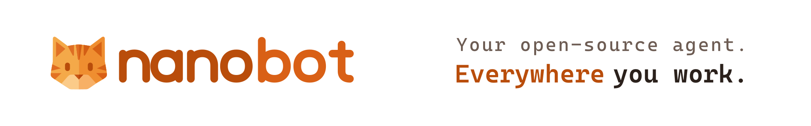
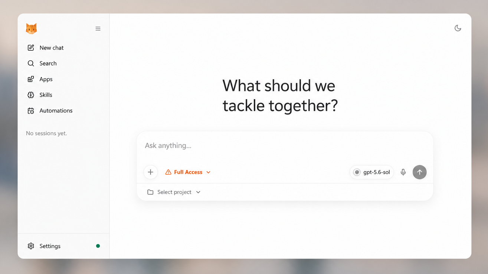

<picture>
  <source media="(prefers-color-scheme: dark)" srcset="./images/readme-cover-dark.svg">
  
</picture>

<div align="center">
  <p>
    <a href="https://nanobot.wiki/docs/latest/getting-started/nanobot-overview">English</a> |
    <a href="https://nanobot.wiki/cn/docs/latest/getting-started/nanobot-overview">简体中文</a> |
    <a href="https://nanobot.wiki/zh-Hant/docs/latest/getting-started/nanobot-overview">繁體中文</a> |
    <a href="https://nanobot.wiki/es/docs/latest/getting-started/nanobot-overview">Español</a> |
    <a href="https://nanobot.wiki/fr/docs/latest/getting-started/nanobot-overview">Français</a> |
    <a href="https://nanobot.wiki/id/docs/latest/getting-started/nanobot-overview">Bahasa Indonesia</a> |
    <a href="https://nanobot.wiki/ja/docs/latest/getting-started/nanobot-overview">日本語</a> |
    <a href="https://nanobot.wiki/ko/docs/latest/getting-started/nanobot-overview">한국어</a> |
    <a href="https://nanobot.wiki/ru/docs/latest/getting-started/nanobot-overview">Русский</a> |
    <a href="https://nanobot.wiki/vi/docs/latest/getting-started/nanobot-overview">Tiếng Việt</a>
  </p>
  <p>
    <a href="https://github.com/HKUDS/nanobot"></a>
    <a href="https://pypi.org/project/nanobot-ai/"></a>
    <a href="https://pepy.tech/project/nanobot-ai"></a>
    <a href="https://github.com/HKUDS/nanobot/actions/workflows/ci.yml"></a>
    <a href="https://pypi.org/project/nanobot-ai/"></a>
    <a href="./LICENSE"></a>
    <a href="https://nanobot.wiki/docs/latest/getting-started/nanobot-overview"></a>
  </p>
  <p>
    <a href="https://discord.gg/MnCvHqpUGB">Discord</a> ·
    <a href="https://x.com/nanobot_project">X</a> ·
    <a href="./COMMUNICATION.md">WeChat / Feishu</a>
  </p>
</div>

# nanobot

🐈 **nanobot** is an ultra-lightweight, open-source, self-hosted personal AI agent framework written in Python. It runs in a WebUI, terminal, or chat apps and combines tools, long-term memory, MCP integrations, model routing, multi-agent delegation, scheduled automation, and an OpenAI-compatible API in a small, readable core.

## Start Here

| You want to... | Go to |
|---|---|
| Install nanobot with no terminal/config background | [Start Without Technical Background](./docs/start-without-technical-background.md) |
| Install quickly and get one CLI reply | [Install](#-install) and [Quick Start](#-quick-start) |
| Open the bundled browser UI | [WebUI](#-webui) |
| Connect Telegram, Discord, WeChat, Slack, Email, Mattermost, or another chat app | [Chat Apps](./docs/chat-apps.md) |
| Configure providers, fallback models, Langfuse, MCP, web tools, or security | [Docs](./docs/README.md) and [Configuration](./docs/configuration.md) |
| Understand or extend the internals | [Architecture](./docs/architecture.md) and [Development](./docs/development.md) |
| Deploy to the cloud or keep nanobot running as a service | [Deployment](./docs/deployment.md) |

## What can nanobot do?

nanobot is a self-hosted personal AI agent runtime. It can:

- run in a browser WebUI or terminal
- connect to Telegram, Discord, Slack, WeChat, Email, Mattermost, and other chat apps
- use tools such as files, shell, web search, web fetch, MCP, cron, image generation, and subagents
- keep session history and long-term memory through Dream
- run long-horizon goals and scheduled automations
- expose a Python SDK and OpenAI-compatible API for integrations
- deploy as a long-running local or server-side agent gateway

## 💡 Why nanobot

- **Persistent workflows**: goals, memory, tools, and chat context survive long-running work.
- **Chat-native reach**: WebUI, API, Telegram, Feishu, Slack, Discord, Teams, email, and Mattermost.
- **Model freedom**: OpenAI-compatible APIs, local LLMs, image generation, search, and fallbacks.
- **Small core**: readable internals with MCP, memory, deployment, and automation built in.
- **Own your stack**: inspect, customize, self-host, and extend without a giant platform.

## 📦 Install

> [!IMPORTANT]
> If you want the newest features and experiments, install from source.
>
> If you want the most stable day-to-day experience, install from PyPI or with `uv`.

Pick **one** install method:

Prerequisites: Python 3.11 or newer. Git is only needed for a source install. Published packages already include the WebUI; a current-source install needs `bun` or `npm` to build it.

If terminals, API keys, or config files are new to you, use the guided zero-background walkthrough in [Start Without Technical Background](./docs/start-without-technical-background.md) instead of this compact README path.

**One-command setup**

macOS / Linux:

```bash
curl -fsSL https://raw.githubusercontent.com/HKUDS/nanobot/main/scripts/install.sh | sh
```

Windows PowerShell:

```powershell
irm https://raw.githubusercontent.com/HKUDS/nanobot/main/scripts/install.ps1 | iex
```

The default command installs or upgrades `nanobot-ai` from PyPI. On a fresh local desktop, it then starts `nanobot webui` so you can configure the first provider and model in **Settings → Models**. SSH, headless, existing-config, and older-release paths keep the terminal setup wizard. The installer avoids system-wide pip installs by using an active virtual environment, `uv`, `pipx`, or a managed venv under `~/.nanobot/venv`. It also prints the exact command it used to run nanobot; reuse that full command below if `nanobot` is not on `PATH`.

To preview the plan without changing your environment, pass `--dry-run`; combine it with `--dev` when you want to preview the main-branch install.

```bash
curl -fsSL https://raw.githubusercontent.com/HKUDS/nanobot/main/scripts/install.sh | sh -s -- --dry-run
```

```powershell
& ([scriptblock]::Create((irm https://raw.githubusercontent.com/HKUDS/nanobot/main/scripts/install.ps1))) --dry-run
```

To install the current `main` branch instead, pass `--dev`:

```bash
curl -fsSL https://raw.githubusercontent.com/HKUDS/nanobot/main/scripts/install.sh | sh -s -- --dev
```

```powershell
& ([scriptblock]::Create((irm https://raw.githubusercontent.com/HKUDS/nanobot/main/scripts/install.ps1))) --dev
```

If you prefer to inspect the script first, open [`scripts/install.sh`](./scripts/install.sh) or [`scripts/install.ps1`](./scripts/install.ps1).

**Install with `uv`**

```bash
uv tool install nanobot-ai
```

**Install from PyPI with pip**

```bash
python -m pip install nanobot-ai
```

If pip reports `externally-managed-environment` on macOS or Linux, use the one-command installer, `uv tool install nanobot-ai`, `pipx install nanobot-ai`, or install inside a virtual environment.

**Install from source**

`bun` or `npm` must be available. From an activated virtual environment:

```bash
git clone https://github.com/HKUDS/nanobot.git
cd nanobot
python -m pip install .
```

On Windows, if pip reports that it cannot launch `npm`, run `cd webui`, `npm.cmd install --package-lock=false`, `npm.cmd run build`, and `cd ..` in order, then retry the install. Contributors who need an editable checkout should follow [`CONTRIBUTING.md`](./CONTRIBUTING.md) and [`webui/README.md`](./webui/README.md).

Verify the install:

```bash
nanobot --version
```

If `nanobot` is not on `PATH`, invoke it through the method that installed it: reuse the recommended installer's command, use `uv tool run --from nanobot-ai nanobot ...` or `pipx run --spec nanobot-ai nanobot ...`, or use the Python executable from the environment where pip installed the package.

## 🚀 Quick Start

**Open nanobot in your browser**

```bash
nanobot webui
```

This is the recommended first run. The launcher creates the config and workspace when needed, safely enables the local WebSocket channel after confirmation, starts the gateway, and opens [`http://127.0.0.1:8765`](http://127.0.0.1:8765). A fresh install can open before a model is configured, so setup continues in the browser instead of beginning in a JSON file. The first-run WebUI binds to localhost by default and is not exposed to your LAN.

**Your first three steps**

1. Open **Settings → Models** and choose a provider, credential, and model.
2. Start a new topic and send `Hello!` to verify the connection.
3. Before project work, choose the intended workspace and access mode from the composer.

Any normal reply means the provider, model, workspace, and browser gateway are working together.

**Keep nanobot running after you close the terminal**

```bash
nanobot webui --background
```

This starts the same full gateway as `nanobot webui`, opens the browser, and leaves channels and automations running after the launcher exits. Complete first-time model setup with foreground `nanobot webui` before switching to background mode.

```bash
nanobot gateway status
nanobot gateway logs
nanobot gateway restart
nanobot gateway stop
```

**Prefer a gateway-first workflow?**

```bash
nanobot gateway
```

This skips WebUI setup and browser opening, then runs the same complete gateway in the current terminal. It is the familiar entry point if you are coming from OpenClaw or already operate agents as long-lived services. The WebUI remains available when its channel is configured; open it manually when needed.

Use `nanobot gateway --background` for the same direct entry point without keeping the terminal attached. For automatic startup and supervision by the operating system, see [Deployment](./docs/deployment.md).

**Prefer to work entirely in the terminal?**

```bash
nanobot agent
```

This opens an interactive terminal chat with the same configured model, workspace, and tools while keeping its own CLI session history. It does not open a browser or keep chat channels and automations running after you exit. Type `exit` or press `Ctrl+C` when you are done.

For one request and an immediate exit, use:

```bash
nanobot agent -m "Hello!"
```

The one-shot form is useful for a quick provider check, shell scripts, and local automation. If you have not configured a model yet, run `nanobot webui` and open **Settings → Models** first.

Need manual JSON, another device on your LAN, or help with provider/model matching? Continue with [Install and Quick Start](./docs/quick-start.md), [WebUI](./docs/webui.md), or [Troubleshooting](./docs/troubleshooting.md).

If nanobot worked for you, a star on GitHub is the simplest way to support the project.

- Want a pasteable provider setup? See [Provider Cookbook](./docs/provider-cookbook.md)
- Want to understand provider/model matching? See [Providers and Models](./docs/providers.md)
- Want web search, MCP, security settings, or more config options? See [Configuration](./docs/configuration.md)
- Want to run locally? See [Ollama](./docs/providers.md#ollama), [vLLM or another local OpenAI-compatible server](./docs/providers.md#vllm-or-other-local-openai-compatible-server), and the full [provider reference](./docs/configuration.md#providers).
- Want to run nanobot in chat apps like Telegram, Discord, WeChat or Feishu? See [Chat Apps](./docs/chat-apps.md)
- Want Docker or Linux service deployment? See [Deployment](./docs/deployment.md)

<a id="deploy-to-render"></a>

## ☁️ Deploy

**Render — one click**

Deploy nanobot's gateway and bundled WebUI from the repository's ready-to-use Blueprint:

[](https://render.com/deploy?repo=https://github.com/HKUDS/nanobot)

Render will ask for `ANTHROPIC_API_KEY` and a private `NANOBOT_WEB_TOKEN`, then provision persistent storage for sessions, memory, and WebUI history. Persistent disks require a paid Render service.

**Self-host**

Prefer your own infrastructure? Follow the [deployment guide](./docs/deployment.md) for Docker, Docker Compose, Linux services, and macOS LaunchAgent setup.

## 🌐 WebUI

The WebUI ships **inside the published wheel** with no separate frontend build. It is the browser workbench for persistent topics, visible agent activity, workspace controls, Apps, Skills, Automations, and settings.

<p align="center">
  
</p>

Use it to:

- keep separate topics for different tasks and projects;
- inspect reasoning, tool calls, file edits, diffs, command output, and generated artifacts;
- switch models and workspaces without leaving the conversation;
- configure providers, chat channels, Apps, Skills, and Automations from one place.

See the [WebUI guide](./docs/webui.md) for LAN access, background operation, workspace controls, and the full feature tour. Working on the frontend itself? Use [`webui/README.md`](./webui/README.md).

## 🏗️ Architecture

<p align="center">
  
</p>

🐈 nanobot stays lightweight by centering everything around a small agent loop: messages come in from chat apps, the LLM decides when tools are needed, and memory or skills are pulled in only as context instead of becoming a heavy orchestration layer. That keeps the core path readable and easy to extend, while still letting you add channels, tools, memory, and deployment options without turning the system into a monolith.

## 📚 Docs

Browse the [repo docs](./docs/README.md) for the latest features and GitHub development version, or visit [nanobot.wiki](https://nanobot.wiki/docs/latest/getting-started/nanobot-overview) for the stable release documentation.

- Use task-oriented guides: [Guides](./docs/guides/README.md)
- Start with no technical background: [Start Without Technical Background](./docs/start-without-technical-background.md)
- Start from zero with developer basics: [Install and Quick Start](./docs/quick-start.md)
- Understand the runtime model: [Concepts](./docs/concepts.md)
- Read the source-level map: [Architecture](./docs/architecture.md)
- Choose a provider/model: [Providers and Models](./docs/providers.md)
- Copy provider setup recipes: [Provider Cookbook](./docs/provider-cookbook.md)
- Debug setup and runtime failures: [Troubleshooting](./docs/troubleshooting.md)
- Talk to your nanobot with familiar chat apps: [Chat App AI Agent](./docs/guides/chat-app-ai-agent.md) · [Chat Apps](./docs/chat-apps.md)
- Schedule or trigger agent work: [Automations](./docs/automations.md)
- Configure providers, web search, MCP, and runtime behavior: [Configuration](./docs/configuration.md)
- Integrate nanobot with local tools and automations: [OpenAI-Compatible API](./docs/openai-api.md) · [Python SDK](./docs/python-sdk.md)
- Run nanobot with Docker or as a Linux service: [Deployment](./docs/deployment.md)

## Releases

**Latest release: [v0.3.0 - The Agency Release](https://github.com/HKUDS/nanobot/releases/tag/v0.3.0)**

The Agency Release turns nanobot from a durable workbench into an agent runtime that can coordinate helpers, switch models per session, and carry authorized work through to completion.

- Consult inline subagents without leaving the current task
- Switch model presets per session directly from the composer
- Start from a guided WebUI setup with clearer execution controls
- Apply configuration changes live across a more reliable provider, channel, and tool runtime

[Read the v0.3.0 release notes](https://github.com/HKUDS/nanobot/releases/tag/v0.3.0)

## Recent Updates

- **2026-07-24** Guided first-run setup, inline subagents, and model switching from the composer.
- **2026-07-23** Grok OAuth with hosted X Search, live image settings, and clearer fallback models.
- **2026-07-22** Parallel Search, live configuration reloads, richer app discovery, and a smoother mobile WebUI.
- **2026-07-21** Codex fast mode, visible skill references, safer configuration saves, and sturdier task cleanup.
- **2026-07-20** Cleaner code blocks and copy actions, self-contained channels, and steadier QQ reconnects.

For older updates, see the [release archive](./docs/release-archive.md) or [GitHub releases](https://github.com/HKUDS/nanobot/releases).

## Open Source Partners

<p align="center">
  <a href="https://platform.kimi.com?aff=nanobot"><picture><source media="(prefers-color-scheme: dark)" srcset="https://kimi-file.moonshot.cn/prod-chat-kimi/kfs/4/1/2026-06-05/1d8h69mt3v89kkekg24gg"></picture></a>
  <a href="https://platform.minimaxi.com/subscribe/token-plan?code=GILTJpMTqZ&source=link"></a>
</p>

## 🤝 Contribute

Use nanobot for a real task, report what broke, and then pick a focused improvement.

- Read [CONTRIBUTING.md](./CONTRIBUTING.md) for the development workflow.
- Browse [open issues](https://github.com/HKUDS/nanobot/issues) for problems to investigate.
- Open a [pull request](https://github.com/HKUDS/nanobot/pulls) for a focused fix or integration.

## Contact

Nanobot was started by [Xubin Ren](https://github.com/re-bin) as a personal open-source project and is now maintained collaboratively with contributors from the open-source community. Feel free to contact [xubinrencs@gmail.com](mailto:xubinrencs@gmail.com) for questions, ideas, or collaboration.

### Contributors

<a href="https://github.com/HKUDS/nanobot/graphs/contributors">
  
</a>

<p align="center">
  <em> Thanks for visiting ✨ nanobot!</em><br><br>
  
</p>
